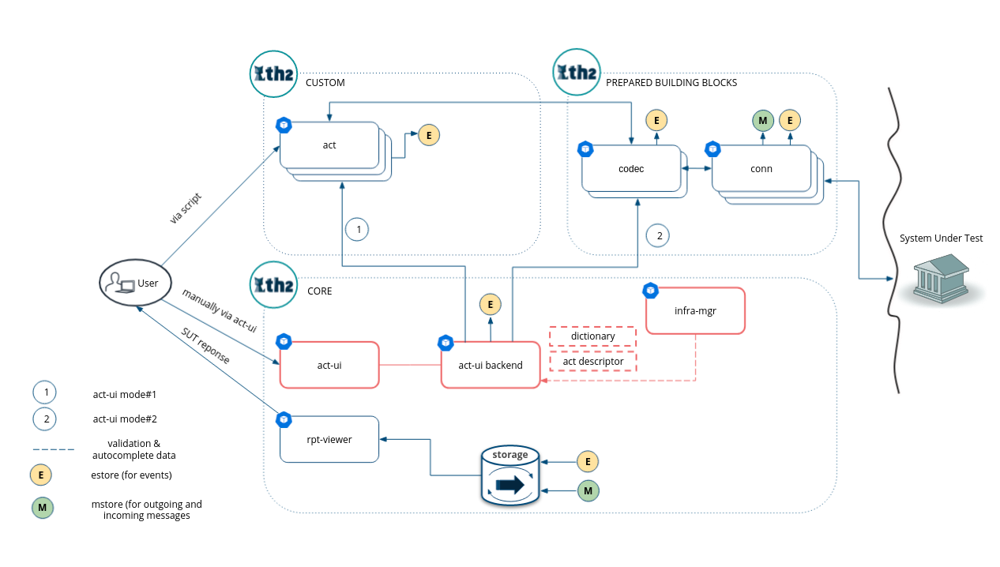

# Act-ui


This app could be used to manually interact with the system under test. There are two modes of interaction:
1. Sending messages to conn components directly
2. Invoking act methods

This repository only contains a web app. For act-ui to fucntion properly there is required second component: [act-ui-backend](https://github.com/th2-net/th2-act-ui-backend). It has to be deployed and should be accessible on `{act-ui-path}/backend/*` (if act-ui has link `https://cluster-name/namespace-name/act-ui`, act-ui-backend should be accessible on `https://cluster-name/namespace-name/act-ui/backend/`)

# Architecture


# Configuration
To include this component in your schema, a following yml file needs to be created
```
apiVersion: th2.exactpro.com/v1
kind: Th2CoreBox
metadata:
  name: act-ui
spec:
  image-name: ghcr.io/th2-net/th2-act-ui
  image-version: 1.0.17
  type: th2-rpt-viewer
  extended-settings:
    resources:
      limits:
        memory: 300Mi
        cpu: 210m
      requests:
        memory: 100Mi
        cpu: 20m

```

# Screenshots

